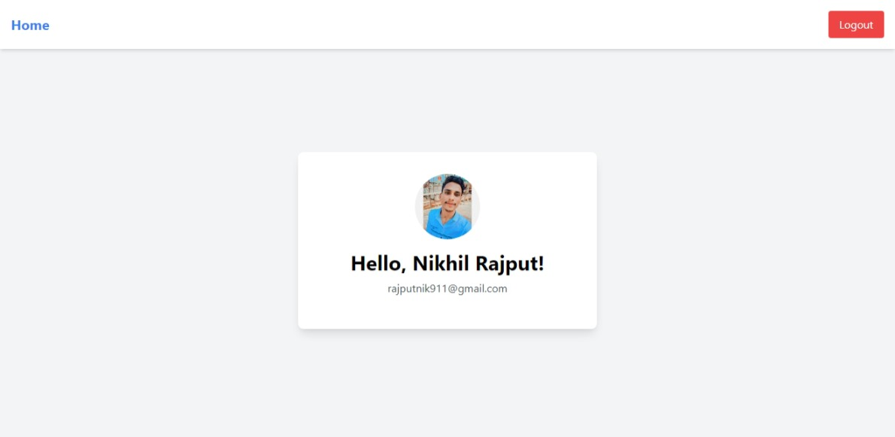
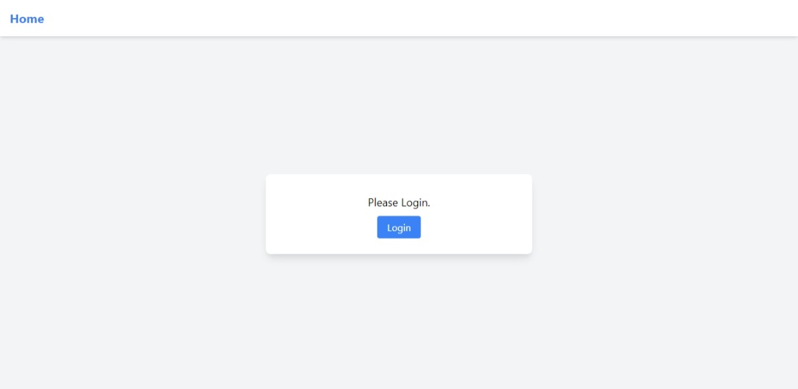

# Auth0 Express Demo

This is a simple Express.js application demonstrating user authentication using Auth0. The application includes basic login and logout functionality.

## Features

- User Authentication (Login/Logout)
- Display user profile information

## Technologies Used

- Node.js
- Express.js
- Auth0
- dotenv (for environment variables)
- EJS (for templating)

## Demo





## Getting Started

### Prerequisites

Make sure you have the following installed on your local machine:

- Node.js
- npm

### Installation

1. Clone the repository:
   ```sh
   git clone https://github.com/yourusername/auth0-express-demo.git
   cd auth0-express-demo
   ```
2. Install dependencies

   ```sh
   npm install
   ```

3. Create a .env file in the root directory and add Auth0 configuration

   ```sh
   SECRET=your_auth0_secret
   BASE_URL=http://localhost:3000
   CLIENT_ID=your_auth0_client_id
   ISSUER=https://your-auth0-domain/
   ```

4. Start the server
   ```sh
   npm run dev
   ```

## Running the Application

1.Open your browser and navigate to http://localhost:3000.

2.You should see the home page with options to log in or log out.
